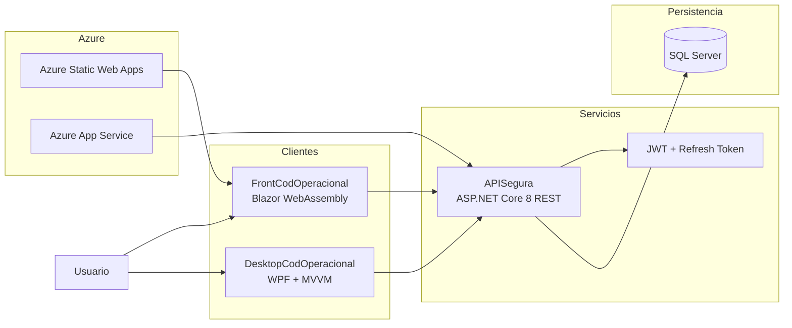
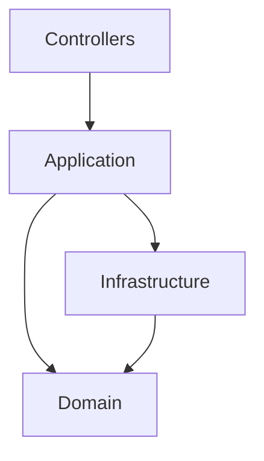
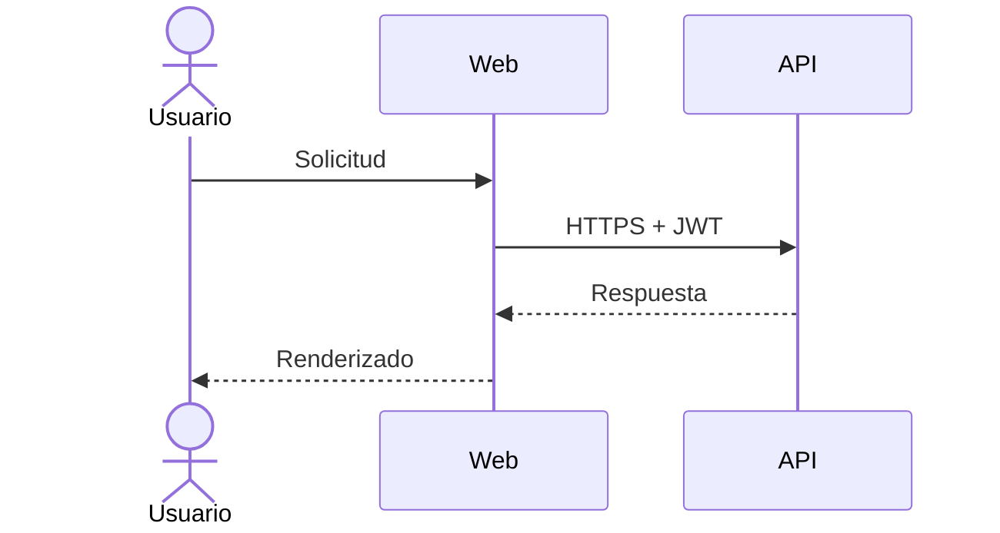
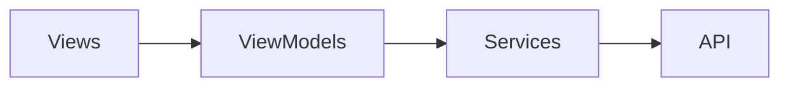
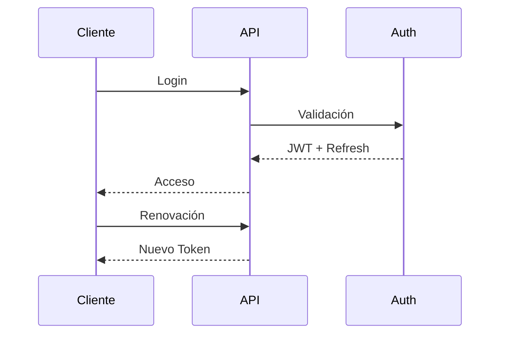
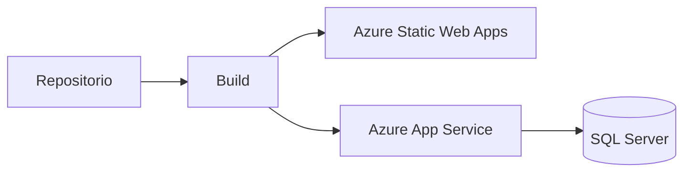

# CodOperacional


---

## Resumen Ejecutivo

**CodOperacional** es una plataforma empresarial orientada a la administración y actualización del **Código Operacional de packing y cuarteles productivos**, permitiendo operar desde clientes Web y Desktop sobre una plataforma centralizada y segura.

La solución busca consolidar la lógica de negocio en un único backend, reducir duplicidad funcional y habilitar una evolución tecnológica escalable y mantenible.

---

# Visión General de la Solución



---

# Principios Arquitectónicos

La plataforma fue diseñada siguiendo principios orientados a soluciones empresariales:

* Single Source of Truth
* API First
* Clean Architecture
* Separation of Concerns
* Security by Design
* Stateless Backend
* Escalabilidad Horizontal
* Bajo Acoplamiento
* Alta Cohesión

---

# Componentes de la Solución

---

# 🔐 APISegura

Backend responsable de exponer capacidades del dominio mediante contratos REST seguros.

## Responsabilidades

* Autenticación y autorización
* Gestión centralizada de reglas de negocio
* Exposición de endpoints REST
* Administración de sesiones
* Integración con clientes Web y Desktop
* Acceso a datos SQL Server

---

## Tecnologías

| Área          | Tecnología    |
| ------------- | ------------- |
| Plataforma    | .NET 8        |
| API           | ASP.NET Core  |
| Persistencia  | SQL Server    |
| Seguridad     | JWT           |
| Sesión        | Refresh Token |
| Contratos     | REST          |
| Documentación | Swagger       |

---

## Arquitectura Lógica



---

## Estructura

```text
APISegura
│
├── Controllers
├── Application
│   ├── DTOs
│   ├── Services
│   └── UseCases
│
├── Domain
│   ├── Entities
│   ├── Interfaces
│   └── Rules
│
├── Infrastructure
│   ├── Persistence
│   ├── Security
│   └── ExternalServices
│
└── Configuration
```

---

# 🌐 FrontCodOperacional

Cliente Web encargado de la interacción operacional desde navegador.

## Capacidades

* Consumo desacoplado vía REST
* Gestión segura de sesión
* Navegación basada en roles
* Componentización UI
* Operación distribuida

---

## Tecnologías

| Área         | Tecnología         |
| ------------ | ------------------ |
| Interfaz     | Blazor WebAssembly |
| Componentes  | Razor              |
| Seguridad    | JWT                |
| Comunicación | HttpClient         |

---

## Modelo de Interacción



---

# 🖥 DesktopCodOperacional

Aplicación Windows para operación local y productividad.

## Capacidades

* Arquitectura MVVM
* Consumo seguro del backend
* Separación View / ViewModel
* Integración desacoplada

---

## Tecnologías

| Área         | Tecnología |
| ------------ | ---------- |
| Interfaz     | WPF        |
| Arquitectura | MVVM       |
| Plataforma   | .NET 8     |
| Integración  | REST       |

---

## Arquitectura Desktop



---

# Modelo de Seguridad

La plataforma implementa autenticación basada en tokens con renovación controlada.



---

## Controles de Seguridad

| Control              | Estado       |
| -------------------- | ------------ |
| JWT                  | Implementado |
| Refresh Token        | Implementado |
| HTTPS                | Implementado |
| Roles                | Implementado |
| Renovación de sesión | Implementado |

---

# Arquitectura de Despliegue



---

## Infraestructura Azure

| Servicio              | Propósito    |
| --------------------- | ------------ |
| Azure Static Web Apps | Front Web    |
| Azure App Service     | Backend      |
| SQL Server            | Persistencia |

---

# Configuración de Desarrollo

## Restaurar dependencias

```bash
dotnet restore
```

---

## Compilar

```bash
dotnet build
```

---

## Ejecutar Backend

```bash
cd APISegura
dotnet run
```

Swagger:

```text
https://localhost:xxxx/swagger
```

---

## Ejecutar Front Web

```bash
cd FrontCodOperacional
dotnet run
```

---

## Ejecutar Desktop

```text
Abrir solución en Visual Studio
Ejecutar DesktopCodOperacional
```

---

# Hoja de Ruta

## Fundación

* [x] Arquitectura inicial
* [x] Backend centralizado
* [x] Cliente Web
* [x] Cliente Desktop

---

## Seguridad

* [x] JWT
* [x] Refresh Token
* [x] Control por Roles

---

## Plataforma

* [ ] Observabilidad
* [ ] Auditoría
* [ ] Métricas

---

## Escalabilidad

* [ ] CI/CD
* [ ] Automatización de despliegue
* [ ] Alta disponibilidad
* [ ] Escalamiento horizontal

---

# Gobierno Técnico

## Versionado

Semantic Versioning

```text
MAJOR.MINOR.PATCH
```

---

## Estrategia de Ramas

```text
main
develop
feature/*
release/*
hotfix/*
```

---

# Estado del Proyecto

**Estado:** En Desarrollo
**Objetivo actual:** Consolidación funcional, endurecimiento de seguridad y preparación para despliegue productivo.

---

© CodOperacional — Plataforma Operacional Empresarial
